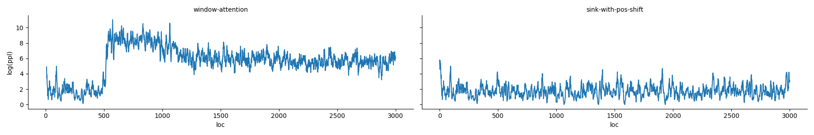

# replicate-attention-sink
This repo is to replicate the paper [Efficient Streaming Language Models with Attention Sinks](https://arxiv.org/abs/2309.17453) by Xiao et al. My goal is to replicate the first two rows of Table 1 from the paper:


Due to memory constraint, I used `Llama-2-7b` model with cache size of `512`. I experimented with the same 60k-token long document as in the paper.

I showed results from three experiments
* (1) Window attention with 0 initial tokens (`window-attention`) has the worst perplexity (PPL=307.297).
* (2) Adding 4 initial tokens as attention sink, but keep the original positional embedding based on positions _in the original text_ (`sink-no-pos-shift`) does not improve the perplexity as compared to window attention (PPL=). 
* (3) Adding 4 initial tokens as attention sink, and assign the positional embedding _within cache_ (`sink-with-pos-shift`) drastically improve the perplexity (PPL=6.016). 

Additionally, I plotted the perplexity for the first 3000 tokens and showed that perplexity of window attention spikes as soon as the sequence length exceeds cache size, whereas the perplexity of attention sink with modified positional embedding remains stable.


## Usage
### Environment Setup
```sh
conda create -n attention-sink python=3.10
pip install -r requirements.txt
```

### Download data
I followed the original paper to experiment with the first document from [PG-19](https://github.com/google-deepmind/pg19) test set.

To download, run:
```
wget https://storage.googleapis.com/deepmind-gutenberg/test/10146.txt
```

### Run Experiments
1. Window attention (0 initial token):
```
python3 script.py --n-start 0 --output-dir outputs/window-attention
```

2. Use 4 initial tokens as attention sink without changing positional embedding:
```
python3 script.py --n-start 4 --output-dir outputs/sink-no-pos-shift
```

3. Use 4 initial tokens as attention sink with positional embedding based in cache position:
```
python3 script.py --n-start 4 --enable-pos-shift --output-dir outputs/sink-with-pos-shift
```

### Plot perplexity of first 3000 tokens

```
python3 graph.py
```

## Contributions
The [code](https://github.com/mit-han-lab/streaming-llm/blob/main/streaming_llm/pos_shift/modify_llama.py) that modifies positional embedding in the paper's original github repo is compatible with `transformers==4.33.1`. I modified the code (`modify_llama.py`) so it is compatible with current `transformers==4.39.1`. The major differences between the two versions of `transformers` are that (1) `position_ids` changed from a Tensor object to a DynamicCache() instance and (2) Changes in the `LlamaRotaryEmbedding` class.
